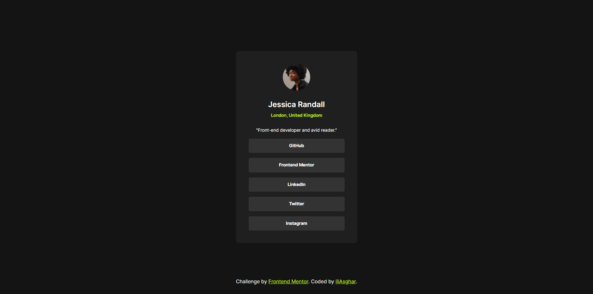

# Frontend Mentor - Social links profile solution

This is a solution to the [Social links profile challenge on Frontend Mentor](https://www.frontendmentor.io/challenges/social-links-profile-UG32l9m6dQ). Frontend Mentor challenges help you improve your coding skills by building realistic projects.

## Table of contents

- [Overview](#overview)
  - [The challenge](#the-challenge)
  - [Screenshot](#screenshot)
  - [Links](#links)
- [My process](#my-process)
  - [Built with](#built-with)
  - [What I learned](#what-i-learned)
  - [Continued development](#continued-development)
- [Author](#author)

## Overview

### The challenge

Users should be able to:

- See hover and focus states for all interactive elements on the page

### Screenshot



### Links

will add them shortly

## My process

### Built with

- Semantic HTML5 markup
- CSS custom properties
- Flexbox
- Desktop-first workflow

### What I learned

this challange helped me reinforce my layout flow knowlendge and practice working with flexbox and responsive layouts.


in my HTML markup , something that i wanted to  do was to make the image not draggable in the page. so i learned to do that by adding ```draggable="false"``` to the `````` tag :

```html

```
for my stylesheets , first i used a [**css reset**](./assets/stylesheets/reset.css) that i found here :
 https://meyerweb.com/eric/tools/css/reset/
 
 css reset helps me get rid of additional properties and unwanted values . so it will provide me with a base for styling the elements.

i also made a [font face file](./assets/stylesheets/font-face.css) to bring my local fonts to the mix.


my [style.css](./assets/stylesheets/style.css) is pretty much self explanatory . with styles for my containers , buttons and other elements ; however , i will elaborate some of my CSS here :
<br>

<li>
 I used some CSS Variables to define my colors : 
 
  ```css
  :root {
  --Green: hsl(75, 94%, 57%);
  --white: hsl(0, 0%, 100%);
  --gray: hsl(0, 0%, 20%);
  --dark-gray: hsl(0, 0%, 12%);
  --off-black: hsl(0, 0%, 8%);
}
 ```
</li>
<li>
 I used a min() function for my main container's width to make the page responsive with smaller widths: 

 ```css
 .profile-container {
  ...
  width: min(100vw , 19rem);
  ...
}
 ```
</li>
<li>
I also changed the style of my buttons on :focus and :hover like this :

```css
.button:focus-visible {
  outline: 2px var(--gray) solid;
  outline-offset: 3px;
}

.button:hover {
  background-color: var(--Green);
  color: var(--dark-gray);
}
```
</li>

the rest of my styling is pretty much using flexboxes and setting font properties . you can check them all [here](./assets/stylesheets/style.css)

### Continued development

for the next projects, i want to focus on making them responsive . even though this projact turned out exactly how i wanted it to , i want to continue learning responsive layouts and use them more confidently in the future.

## Author

- Frontend Mentor - [@iliAsghar](https://www.frontendmentor.io/profile/iliAsghar)
- Twitter - [@iliAsghar](https://www.twitter.com/iliAsghar)
- Codepen - [@ili-Asghar](https://codepen.io/ili-Asghar)